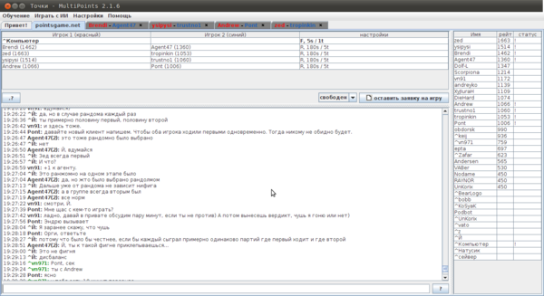
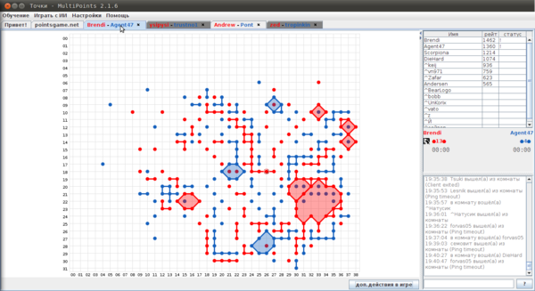

## About
Клиент для игры Точки

## Building

Build the project with `sbt createSignedJar`.

## Исходники MultiPoints

Исходники MultiPoints открыты и доступны по адресу https://github.com/vn971/multipoints

Лицензия - GPL v2. Для работы с исходниками MultiPoints вам понадобятся:

  * Компилятор джавы JDK. В линуксе пакет называется openjdk-7-jdk. В винде надо залезть на сайт и пытаться выбрать версию jdk без нахлобучек и доп.пакетов, мегов на 20-30.
  * IDE. Я лично использую для разработки eclipse http://eclipse.org
  * система контроля версий git https://git-scm.com/
  * средство сборки проектов SBT http://scala-sbt.org/
  * также желательно наличие аккаунта на https://github.com

## Компоненты программы

Программа в первом приближении состоит из трёх слоёв:
  * чистый GUI
  * чистая серверная часть
  * менеджер GUI (промежуточная часть)

Серверная часть отвечает за общение с физическим (удалённым) сервером, чистый GUI отвечает за прорисовку, менеджер GUI отвечает за взаимодействие первого и второго.

## Схема взаимодействия
Схема взаимодействия слоёв в большинстве случаев одна из двух видов.
Первый вид:

  * происходит событие на сервере =>
  * серверная часть получает событие, преобразует его в надлежащую форму, отсылает менеджеру GUI =>
  * менеджер GUI находит нужную компоненту GUI которая должна отразить изменение (возможно несколько), отсылает компоненте относящиеся к ней данные =>
  * нужная компонента GUI отрисовывает изменение.

Второй наиболее популярный вид взаимодействия:

  * пользователь что-то тыкает в GUI =>
  * часть с чистым GUI получает изменение, _у себя никак графически ничего не изменяет_, отсылает событие =>
  * если действие было только визуально, то событие отправляется менеджеру GUI.
  * если действие содержит в себе какие-то данные для отсылки серверу, то событие адресуется серверной части =>
  * серверная часть отсылает изменения на физический удалённый сервер =>
  * если сервер не поддерживает отчётов о получении, то серверная часть тут же отсылает менеджеру GUI отправленные ("подтверждённые") данные.

Также, для компонент GUI доступна операция "подписи за обновлениями" некоторых событий сервера. Например, есть компоненты, которые подписываются на изменения описания игры. Когда описание игры изменяется, компоненты автоматически обновляются. Разница между таким способом обновления и способом через менеджер в том, что менеджер чётко знает какие компоненты ему нужно обновить (чаще всего это одна или две), в то время подписчиков может быть сколь угодно много, и они не связаны никак между собой.

Одна из задач, которые я хочу попробовать для MultiPoints -- это перевести все имеющиеся компоненты в подписчиков, для более единообразной работы программы. Но пока-что это только на стадии разработки/обдумки, поэтому общение ведётся и через подпись на обновление, и через менеджер GUI.

## Ключевые компоненты GUI
  * чат. Позволяет принимать сообщения от пользователя и прорисовывать входящие сообщения.
  * список игр. Позволяет "тыкать" по играм для захода в них.
  * список пользователей.
  * ... (надо будет дописать потом)

## описание классов
  * com.google.sites.priymakpoints.* -- классы Алексея Приймака. Там работа с встроенным ИИ, а также обучалка "pointsIQ".
  * Ai2GuiInterface, Gui2Ai_Interface -- интерфейсы для общения с ИИ версии 2 (старая).
  * ConsoleAi6, ConsoleGui6 -- интерфейсы для общения с ИИ, версия 6 (последняя).
  * KeijKvantttAi -- реализация интерфейся для общения с ИИ. Называется почему-то KeijKvanttt, но на самом деле работает с любой программой имплементирующей интерейс.
  * RandomAI -- тестовый ИИ.
  * DotColored, Dot -- классы в состоянии разработки.
  * GameInfoListener -- класс через который GUI может подписываться на изменения описания комнаты.
  * GameOuterInfo -- класс, хранящий "внешнюю" информацию о комнате.
  * GamePool -- внутренний класс для GuiController.
  * PlayerChangeListener -- класс через который GUI может подписываться на изменения информации об игроке.
  * Sgf -- класс, отвечающий за работу с SGF.
  * TimeLeft, TimeSettings -- класс, через который Server объясняет GUI сколько у каждого игрока осталось время и "тикает" ли оно (уменьшается).
  * RandomMovesProvider -- класс генерит произвольные ходы. Делает это быстро, даже когда поле почти полностью заполненное.
  * SingleGameEngineInterface -- интерфейс для просчёта окружений на поле
  * SingleGameEngine -- класс, просчитывающий окружения на поле. Он помнит расположение точек на поле, все окружения. Умеет принимать новые точки, просчитывать окружения и говорить что получилось.
  * AiPanel -- вкладка (tab) для игры с ИИ. В разработке, по сути ничего там нет.
  * GameInvitePersonal -- всплывающее окошко с настройками индивидуального приглашения на игру.
  * GameRoom -- вкладка с игрой
  * GameSettings -- всплывающее окошко с настройками создания новой игры
  * GuiCommon -- всякие общие методы GUI. Например, преобразовать цвет "Color" в html-код.
  * JTabbedPaneMod -- класс отвечающий за вкладки (умеет закрывать вкладки, в отличии от дефолтного класса Swing).
  * LangRoom -- языковая комната. Это то, где общий чат на весь сервер. В теории их может быть несколько, но ни на одном из существующих серверов пока такой возможности нет. Функция не тестировалась.
  * Paper -- класс, отвечающий за прорисовку поля. Несовершенный, его много где можно подправить. Рядом вроде даже где-то readme валяется с тем как хочется чтобы оно умело.
  * PrivateChat -- вкладка с приватным чатом.
  * RoomInterface -- попытка выделить общий интерфейс для всех вкладок. Попытка провальная. Ведутся работы по уничтожению этого класса.
  * RoomPart_Chat -- класс отвечающий только за чат. Текст сверху и линия ввода снизу. Такой чат можно вставлять в разные компоненты -- например, в игровую вкладку, во вкладку с общим чатом, во вкладку с приватным чатом и т.п.
  * RoomPart_GameList -- аналогично пункту выше, только список игр.
  * RoomPart_UserList -- аналогично пункту выше, только список игроков.
  * SelfishGuiStarter -- класс с дурацким названием отвечающий за загрузку приложения. Переименовывать нельзя, иначе перестанут работать старые JNLP-файлики. В этом же классе создаётся верхнее меню проги.
  * TabCloseable -- класс, прорисовывающий закрывающуюся вкладку. То пространство на котором название вкладки и крестик чтобы закрыть.
  * TimerLabel -- панелька, показывающая оставшееся время в игре.
  * WelcomePanel -- стартовый tab приветствующий пользователя и дающий возможность зайти дальше на IRC/zagram
  * GuiController -- промежуточный слой между GUI и Server. Смотри выше в описании.
  * ServerInterface -- интерфейс сервера. В нём методы типа "сказать что-то в такой-то комнате", "сходить туда-то в такой-то комнате", "сделать то-то"...
  * AiVirtualServer -- класс для сервера. Конкретно, ИИ, прикидывающегося сервером. Это некоторый костыль чтобы вкладка с игрой с ИИ выглядела как комната в живом сервере. Сделал так в своё время по просьбе Алексея Приймака.
  * IrcNicknameManager -- класс для запоминания и извлечения IRC-ников.
  * IrcRegexp -- класс для обработки ников IRC (извлечение о статусе и т.п.)
  * MockServerForGui -- виртуальный класс для сервера. Для тестирования GUI.
  * ServerPointsxt -- класс сервера, присоединяющийся к реальному удалённому IRC-серверу.
  * ServerZagram2 -- класс сервера, присоединяющийся к zagram
  * Sounds -- класс, воспроизводящий звук поставленной точки, приватное сообщение и т.п.

Все GUI-классы разрабатываются в NetBeans, графическим редактором.
